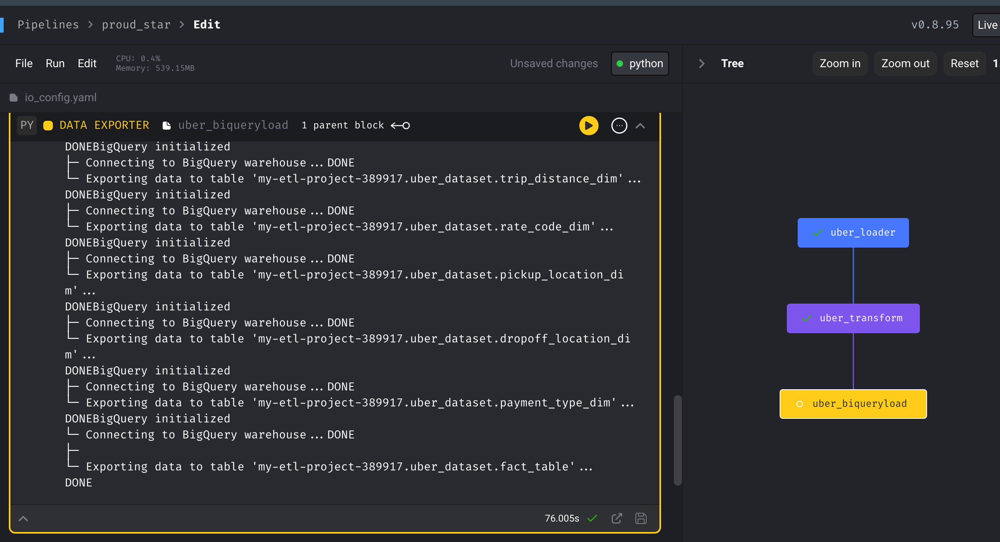

# Index

- [Taxi-trips - ETL Project](#taxi-trips---etl-project)
- [Dataset](#dataset)
- [Project Overview](#project-overview)
- [Getting Started](#getting-started)
- [Creating Data Model using Lucid Chart](#creating-data-model-using-lucid-chart)
- [Setting up Google Cloud Platform (GCP) Storage and Compute Instance](#setting-up-google-cloud-platform-gcp-storage-and-compute-instance)
- [Steps to Use Mage Data Pipeline Tool](#steps-to-use-mage-data-pipeline-tool)
- [Python Codes ETL](#codes)
- [Accessing and Analyzing Data from BigQuery using Tableau](#accessing-and-analyzing-data-from-bigquery-using-tableau)
- [License](#license)

---

# Taxi-trips - ETL Project

# Uber Data Analytics Project

             

## Dataset

The dataset used in this project is the TLC Trip Record Data, which can be found on the [NYC TLC Trip Record Data website](https://www.nyc.gov/site/tlc/about/tlc-trip-record-data.page). The data dictionary for the trip records can be accessed [here](https://www.nyc.gov/assets/tlc/downloads/pdf/data_dictionary_trip_records_yellow.pdf).

Dataset Location: [Uber Dataset](https://github.com/midhunrajds/taxi-trips--etl-project/main/data/uber_data.csv)

## Project Overview

The project involves the following steps:

1. **Set up GCP Storage**: Create a storage bucket in Google Cloud Platform (GCP) to store the Uber dataset and intermediate files.

2. **Data Ingestion**: Download the Uber dataset and upload it to the GCP Storage bucket.

3. **Data Transformation with Python**: Use Python to read the Uber dataset, clean the data, and perform necessary transformations and calculations.

4. **Data Pipeline with Mage Data Pipeline Tool**: Set up the Mage Data Pipeline Tool on a Compute Instance in GCP to orchestrate the data processing steps and store the transformed data in BigQuery.

5. **Data Loading into BigQuery**: Create a BigQuery dataset to store the transformed Uber data and configure the data pipeline to load the data into BigQuery tables.

6. **Data Analysis with Tableau**: Use Tableau, a data visualization tool, to connect to the BigQuery dataset and create reports and visualizations for analyzing the Uber data.

## Getting Started

To set up the project and reproduce the analysis, please follow the instructions below:

1. **Step-by-step instructions on setting up GCP Storage, Compute Instance, Mage Data Pipeline Tool, and Tableau**
2. **Instructions on running the data pipeline and loading data into BigQuery**
3. **Instructions on accessing and analyzing the data using Tableau**

## Creating Data Model using Lucid Chart

1. **Create a New Document**:
   - After signing in, click on the "Create" button or go to the "Documents" tab to create a new document.

2. **Add Entities**:
   - Locate the entity shapes or boxes and drag them onto the canvas.
   - Double-click inside each entity box to give it a meaningful name. You can also customize the appearance of the entities.

3. **Add Attributes**:
   - Inside each entity box, add attributes by clicking on the "+" button or using the "Text" tool.
   - Enter attribute names, data types, and any other relevant details.
   - Use lines or connectors to link the attributes to their respective entities.

4. **Create Relationships**:
   - Locate the relationship lines or connectors in the left sidebar.
   - Drag the relationship line onto the canvas and connect it between the related entities.
   - Define the type of relationship (one-to-one, one-to-many, many-to-many) by adding crow's foot notation or other symbols.
   - Add relationship names or labels if necessary.

## Setting up Google Cloud Platform (GCP) Storage and Compute Instance

1. **GCP Storage Setup**:
   - Log in to the [Google Cloud Console](https://console.cloud.google.com) using your Google account.
   - Create a new project or select an existing project.
   - In the navigation menu, go to "Storage" or search for "Storage" in the Cloud Console search bar.
   - Click on "Create Bucket" to create a new storage bucket.
   - Configure access controls and permissions for the bucket to ensure appropriate security measures.
   - "Fine Grain Access" Permission provided to enable edit access using a public URL.

2. **GCP Compute Instance Setup**:
   - In the navigation menu of the Google Cloud Console, go to "Compute Engine" or search for "Compute Engine" in the Cloud Console search bar.
   - Click on "Create" to create a new Compute Engine instance.
   - Provide a name for the instance, select the desired region and zone, and configure other settings such as machine type, boot disk, network settings, etc.
   - Used 4 x CPU, 16 GB Memory EC2 series for this project.
   - Choose the appropriate access and security settings, including SSH key management for remote access to the instance.
   - Review the configuration and click on "Create" to create the Compute Engine instance.
   - Once the instance is created, connect to it using SSH or other remote access methods.

## Steps to Use Mage Data Pipeline Tool

To use Mage from a VM instance:

1. **Start Mage Project**:
   - Start the VM instance and ensure that it has access to the internet.
   - Open a terminal or SSH into the VM instance.
   - Install the necessary packages.
   - Install Mage using pip install.
   - Navigate to the project directory where you want to use Mage.

2. **Go to the Mage URL**:
   - In a web browser, open the Mage URL specified by the project.

3. **Extract and Transform Data**:
   - On the Mage platform, create a new pipeline.
   - Use the provided tools and interfaces to extract data from various sources, such as databases, APIs, or files.
   - Use the data loader using Python and Google API URL.
   - Apply necessary transformations and data manipulations using the available Mage features - Python transformations.
   - Validate and test the transformations to ensure the desired output.

4. **Setup io_config.yaml**:
   - In the Mage project directory on the VM instance, modify the `io_config.yaml` file.
   - Specify the necessary configuration settings in the `io_config.yaml` file, such as database connections, file paths, API credentials, etc.
   - Save the `io_config.yaml` file.

5. **Load/Export Data to BigQuery**:
   - In the Mage project, load/export to BigQuery.
   - Configure the data loading or exporting settings, such as table name, schema mapping, write mode (replace or append), etc.
   - Use the Mage interface to execute the necessary commands to initiate the data loading/exporting process to BigQuery.
   - Monitor the progress and logs to ensure the successful completion of the operation.

6. **Confirmation**:
   - Once the data loading/exporting process is complete, navigate to the BigQuery console on the GCP platform.
   - Confirm that the data has been loaded/exported correctly by querying the respective BigQuery tables or inspecting the data in the console.
   - Perform any necessary data validation or quality checks to ensure the accuracy and integrity of the loaded/exported data.

### Codes:
- [Extract](./Codes/mage_load.py)
- [Transform](./Codes/mage-transfrom.py)
- [Load](./Codes/mage-export.py)

# Accessing and Analyzing Data from BigQuery using Tableau

1. **Connect Tableau to BigQuery**:
   - Launch Tableau Desktop.
   - On the Tableau start page, select "Connect to Data".
   - In the "Connect" pane, under "To a Server", select "Google BigQuery".
   - Enter your Google Cloud Platform (GCP) project credentials to authorize Tableau to access BigQuery.
   - Once connected, locate the BigQuery dataset and tables in the "Data Source" tab.

2. **Select Dataset and Tables**:
   - Select the dataset.
   - Choose the specific tables to include in the analysis.

3. **Create Table Relations**:
   - Drag and drop the necessary tables onto the canvas.
   - Define table relations by clicking and dragging columns between related tables.
   - Verify that the table relations are correctly established.

4. **Analyze Data**:
   - Use Tableau's drag-and-drop interface to select dimensions, measures, and desired visualizations.
   - Apply filters, aggregations, calculations, and other data manipulations for analysis.
   - Create visualizations, dashboards, and reports to present the analyzed data.

## License

This project is licensed under the [MIT License](https://opensource.org/licenses/MIT).
